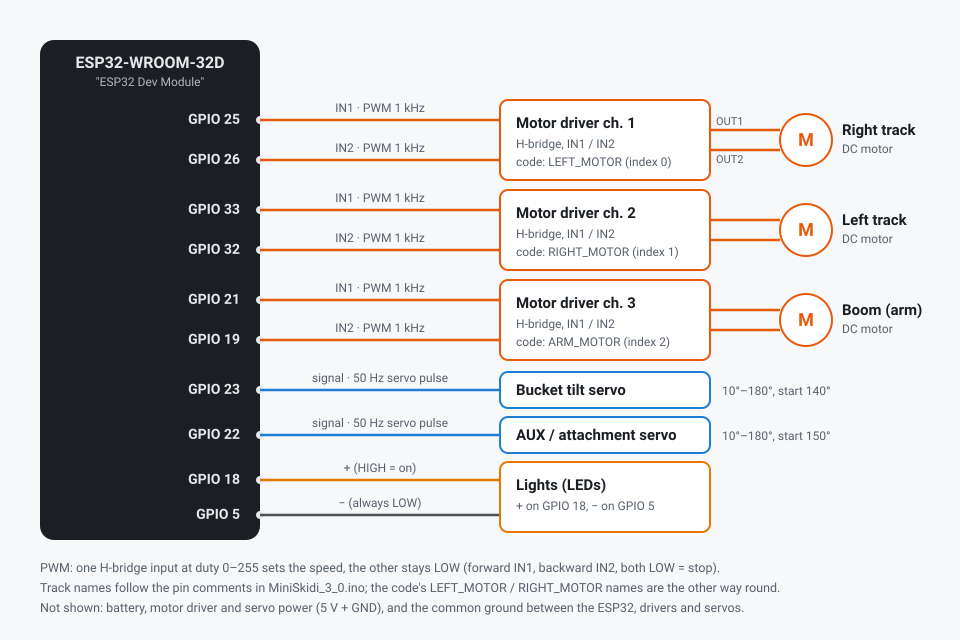

# MiniSkidi 3.0

A rewrite of [https://github.com/ProfBoots/MiniSkidi-V3.0](https://github.com/ProfBoots/MiniSkidi-V3.0)
with a guidance from HellBirdy67 from Discord.

All the code is written by Claude Opus 5.5 with a human in the loop.

Firmware for the MiniSkidi skid steer loader, running on an ESP32-WROOM-32D
("ESP32 Dev Module").

Phone app (Chrome on Android): [https://nvtkaszpir.github.io/miniskidi/](https://nvtkaszpir.github.io/miniskidi/)


## Dependencies

All arduino libraries and dependency versions are pinned in [sketch.yaml](sketch.yaml).

## Option A: arduino-cli (recommended)

`arduino-cli` reads `sketch.yaml` and installs the exact versions listed there.
They go into its own cache, separate from `~/Arduino/libraries`,
so other sketches are not affected.

1. Install `arduino-cli`:

   ```bash
   curl -fsSL https://raw.githubusercontent.com/arduino/arduino-cli/master/install.sh | BINDIR=~/.local/bin sh
   ```

2. Install the Python packages the ESP32 build tools need, listed in
   [pyproject.toml](pyproject.toml). On Linux the ESP32 core runs
   `esptool.py` with the first `python` on `PATH`, and it needs `pyserial`
   (otherwise the build fails with `No module named 'serial'`). With
   [uv](https://docs.astral.sh/uv/):

   ```bash
   uv sync --frozen
   ```

   This creates `.venv` in the sketch folder. `uv run` puts it first on
   `PATH` for the commands below.

3. Build the sketch. The first build downloads the board core and the
   libraries:

   ```bash
   uv run arduino-cli compile --profile miniskidi
   ```

4. Upload to the board. Replace `/dev/ttyUSB0` with your port;
   `arduino-cli board list` shows it:

   ```bash
   uv run arduino-cli upload --profile miniskidi -p /dev/ttyUSB0
   ```

5. Optional: open the serial monitor:

   ```bash
   arduino-cli monitor -p /dev/ttyUSB0 -c baudrate=115200
   ```

## Option B: Arduino IDE

The Arduino IDE does not install the versions pinned in `sketch.yaml`, so install them by hand:

1. **File > Preferences > Additional boards manager URLs**: add
   `https://espressif.github.io/arduino-esp32/package_esp32_index.json`
2. **Tools > Board > Boards Manager**: search for `esp32` by Espressif Systems
   and install version **2.0.17**.
3. **Sketch > Include Library > Manage Libraries**: install these versions:
   - `ESP32Servo` by Kevin Harrington: **3.2.1**
   - `NimBLE-Arduino` by h2zero: **2.5.1**

   On Linux the IDE also runs `esptool.py` with the first `python` on
   `PATH`, so that Python needs `pyserial`
   (`python -m pip install pyserial`).
4. **Tools > Board > esp32**: select **ESP32 Dev Module**.
5. **Tools > Port**: select the port the ESP32 is connected to, for example
   `/dev/ttyUSB0` on Linux or `COM3` on Windows. If no port appears, check
   the USB cable (some cables are charge-only) and the USB-to-serial driver
   (CP210x or CH340).
6. Click **Upload**.
7. **Tools > Serial Monitor**: set the baud rate dropdown in the bottom-right
   corner to **115200**, the speed the sketch uses (`Serial.begin(115200)`).
   Other values show garbled text.

## Updating sketch.yaml

To regenerate the profile from the versions a build actually used:

```bash
arduino-cli compile --fqbn esp32:esp32:esp32 --dump-profile
```

Copy the printed profile into `sketch.yaml`.

## Wiring



The same diagram is in the app's **Wiring** tab.

| GPIO | Connected to | Signal |
|------|--------------|--------|
| 25 | motor driver ch. 1 IN1 → right track | PWM 1 kHz |
| 26 | motor driver ch. 1 IN2 → right track | PWM 1 kHz |
| 33 | motor driver ch. 2 IN1 → left track | PWM 1 kHz |
| 32 | motor driver ch. 2 IN2 → left track | PWM 1 kHz |
| 21 | motor driver ch. 3 IN1 → boom (arm) | PWM 1 kHz |
| 19 | motor driver ch. 3 IN2 → boom (arm) | PWM 1 kHz |
| 23 | bucket tilt servo signal | servo pulse 50 Hz, 544–2400 µs |
| 22 | AUX / attachment servo signal | servo pulse 50 Hz, 544–2400 µs |
| 18 | lights + | HIGH = on |
| 5 | lights − | always LOW |

The pins are defined at the top of [MiniSkidi_3_0.ino](MiniSkidi_3_0.ino)
(`motorPins`, `bucketServoPin`, `auxServoPin`, `lightPin1`, `lightPin2`).
The track names follow the pin comments there; the code's `LEFT_MOTOR` /
`RIGHT_MOTOR` names are the other way round, which is why the "left"
command runs `RIGHT_MOTOR` backward. Power wiring (battery, driver and
servo supply, common ground) is not shown.

## How it works

The MiniSkidi is controlled over **Bluetooth Low Energy (BLE)** only, from a
web app running in **Chrome on Android**. The ESP32 has no Wi-Fi in this
setup.

- The ESP32 runs a BLE server ([Ble.ino](Ble.ino), using
  [NimBLE-Arduino](https://github.com/h2zero/NimBLE-Arduino), Apache-2.0).
- The phone app is a plain web page in [web/](web/). It uses the browser's
  [Web Bluetooth](https://developer.mozilla.org/en-US/docs/Web/API/Web_Bluetooth_API)
  API, so there is nothing to install from an app store. It is free and
  open source, with no account or cloud service.
- Web Bluetooth only works on `https://` pages, so the app is hosted on
  GitHub Pages (free), right . After the first visit it also works offline, and it
  can be installed to the home screen like an app.

iPhones are not supported: Safari and the other iOS browsers have no Web
Bluetooth.

## Publishing the app (one time)

1. Create a **public** repository on GitHub and push this project to it
   (branch `main` or `master`).
2. In the repository, open **Settings > Pages** and set **Source** to
   **GitHub Actions**.
3. The workflow in [.github/workflows/pages.yml](.github/workflows/pages.yml)
   publishes the `web/` folder on every push that changes it. The address
   is shown in the workflow run and on the Pages settings page, for example
   `https://<your-user>.github.io/<repository>/`.

   In this repo - visit [https://nvtkaszpir.github.io/miniskidi/](https://nvtkaszpir.github.io/miniskidi/)
  for the currently rendered github pages.


The workflow writes the commit it publishes into the app: **Settings > Web
app** shows the commit (linked to GitHub), its date and message. It also
puts the commit into the offline cache name in [web/sw.js](web/sw.js), so
installed apps load every new version. A copy served locally shows "local
copy".

## Connecting

1. Change the passkey before the first upload: `blePasskey` in
   [MiniSkidi_3_0.ino](MiniSkidi_3_0.ino) (6 digits, default `123456`).
   It **must not start with 0**: the sketch would read a number like
   `012345` as a different value, so the build stops with an error.
2. Power on the MiniSkidi. The serial monitor shows its Bluetooth name,
   `MiniSkidi-XXXXXX`, where `XXXXXX` is the end of the ESP32 MAC address.
3. On the phone, turn on Bluetooth (on Android 11 and older, also Location),
   open the app address in **Chrome**, and tap **Connect**.
4. Pick `MiniSkidi-XXXXXX` in the list.
5. The first time, Android asks to pair: enter the passkey. The phone stays
   paired after that and connects without the passkey.
6. Optional: Chrome menu ⋮ > **Add to Home screen** / **Install app**. The
   installed app opens fullscreen and works without internet.

Only one phone can be connected at a time. After a connection is lost, the
app reconnects by itself while the page is open. After the page is
reloaded, tap **Connect** again.

### Changing the passkey or removing phones

The MiniSkidi remembers up to 3 paired phones. To make every phone pair
again (for example after changing `blePasskey`):

1. In the app, **Settings > Forget paired phones** (or erase the flash with
   `esptool.py erase_flash`).
2. On each phone, open Android **Settings > Bluetooth**, tap the MiniSkidi,
   and choose **Forget**.

## Using the app

The top bar is the same on every tab:

- **Signal strength**: how well the MiniSkidi receives the phone, in dBm.
  - green: -67 dBm or better
  - amber: -68 to -75 dBm
  - red with **weak**: below -75 dBm, close to losing the connection
  - red **No signal**: no status from the MiniSkidi for 1 second
- **App version**: the commit this copy of the app was published from
  (linked to GitHub), or `local` for a copy served locally
- **Connect / Disconnect**
- the tabs: **Classic**, **Joystick**, **Settings**

### Classic tab

The original MiniSkidi page: arrow buttons for driving and the arm, light
button, and Bucket and AUX sliders. The keyboard shortcuts still work with
a keyboard attached: arrows drive, W/S arm, Q/A bucket, E/D AUX. The motors
run at full speed while a button is held. When the arm stops after going
down, it gets a short upward pulse against its momentum, as in the original
firmware.

### Joystick tab

Landscape layout, the same as the former RemoteXY screen:

| Control                    | Left / right            | Up / down          |
|----------------------------|-------------------------|--------------------|
| Left joystick              | turn left / right       | forward / backward |
| Right joystick             | bucket down / up        | boom up / down     |
| Vertical slider ("Attach") | attachment (AUX) servo, bottom 0 to top 100 | |
| ☼ button                   | lights on / off         |                    |

- The right joystick follows the ISO control pattern: up raises the boom,
  down lowers it, right tilts the bucket up (curl), left tilts it down
  (dump). If the boom or bucket moves the wrong way on your machine, use
  **Invert boom lift** / **Invert bucket tilt** in Settings.
- The right joystick is split into 8 zones, drawn on it: straight up only
  moves the boom, up-right moves the boom up and the bucket up together,
  right only tilts the bucket, and so on. The direction snaps to the zone
  your thumb is in, so a slightly crooked push doesn't move the other
  function; how far you push still sets the speed. The zone in use lights
  up. This can be turned off in Settings.
- The bucket and AUX servo angles are shown in the middle, on the Classic
  tab under the slider names, and in Settings next to the bucket angle
  limits. They are the angles the servos are set to right now (a servo
  can't report its real position).
- The dead zone is drawn on both sticks: the circle in the middle of the
  right stick, the cross on the left stick.
- Both joysticks can be used at the same time with two thumbs.
- Speed follows how far a stick is pushed. Pushing the drive stick
  diagonally makes curves; sideways only turns on the spot.
- Lifting a thumb puts that stick back in the center and stops what it
  controlled.
- The bucket tilt sets a speed, not a position: the bucket keeps tilting
  while the stick is pushed and stays where it is when the stick is let go.
  It moves between 10° and 180°, the same range as the Classic slider.
- Small movements (the dead zone, 15% by default) are ignored, so a resting
  thumb doesn't move the machine. On the left stick (and on the right one
  with the zones turned off) it works separately for each direction, so
  pushing sideways doesn't also send a small forward/backward value.
- Even the smallest movement outside the dead zone gives the motors their
  start power (Settings), so they don't just hum.
- The boom stops as soon as the stick is released, without the Classic
  tab's momentum pulse, so it can be lowered in small steps.
- The tab switches to fullscreen landscape where Android allows it. If the
  phone stays in portrait (for example with rotation lock on), the screen
  is turned sideways; hold the phone in landscape.

### Settings tab

- **Swap joysticks**: driving on the right stick, bucket and boom on the left
- **Swap bucket tilt and boom lift**: boom on horizontal, bucket on vertical
- **Invert bucket tilt**, **Invert boom lift**: for a servo or motor that
  runs the other way, so the stick matches the labels drawn on it
- **8 direction zones on the arm stick** (on by default)
- **Dead zone**: 0 to 40%
- **Speed limits** for the Joystick tab (the Classic tab always runs at
  full speed):

  | Setting | Default | Meaning |
  |---|---|---|
  | Tracks start power | 90 / 255 | track power at the smallest stick movement; raise it if they only hum |
  | Drive top speed | 80% | forward / backward at full stick |
  | Turn top speed | 80% | turning at full stick |
  | Boom start power | 90 / 255 | boom power at the smallest stick movement |
  | Boom top speed | 20% | boom up / down at full stick |
  | Bucket min speed | 0% | bucket tilt speed at the smallest stick movement |
  | Bucket top speed | 20% | bucket tilt speed at full stick (100% = 180°/s) |

  A top speed is the share of the power range above the start power, so a
  low top speed keeps a function slow and precise but still strong enough
  to move. Example: boom at 20% gives about 120 / 255 at full stick.
- **Bucket angle** (min and max, 10° to 180°, at least 10° apart): the
  bucket servo never goes outside this range, from the joystick or the
  Classic slider. Use it to stop the bucket before it pushes against the
  frame or the boom. The bucket moves to a new limit while you drag the
  slider, so you can watch where it stops. The boom has no angle limit: its
  DC motor has no position sensor, so the firmware can't know where it is.
- **Start position**: the bucket and AUX servo angles at power-on (defaults
  140° and 150°). Used at the next power-on, not right away. The bucket
  start angle is kept inside the bucket angle range.
- **Device**: name, Bluetooth address, firmware build date, uptime, chip,
  free memory, connection details, number of paired phones
- **Forget paired phones**

Settings are saved on the MiniSkidi, so they survive a restart and are the
same for every phone.

## Safety

The motors stop when the connection to the phone is lost:

- **Watchdog**: the app sends a message at least every 150 ms. If nothing
  arrives for **500 ms** while anything moves, the MiniSkidi stops all
  motors and the bucket.
- **Bluetooth link loss**: the MiniSkidi asks the phone for a 400 ms
  supervision timeout; after that long without contact the connection is
  dropped and the motors stop. Phones may choose a longer timeout, so the
  watchdog above is the real limit.
- **App in the background**: switching apps, locking the screen or closing
  the page stops everything.
- **Disconnect** stops everything before the connection closes.

The serial monitor logs why the motors were stopped.

## Tuning

Start power and speed limits are set in the app (Settings tab). Constants
at the top of [Drive.ino](Drive.ino):

- `defaultMinDuty`, `defaultDriveMax`, `defaultTurnMax`, `defaultBoomMax`,
  `defaultTiltMin`, `defaultTiltMax`: the speed limits until they are
  changed in the app.
- `motorPwmFreq` (default 1000 Hz): PWM frequency of the motor outputs.
- `bucketMaxRate` (default 180°/s): bucket tilt speed at 100% bucket top
  speed and full deflection.
- `watchdogTimeoutMs` (default 500 ms): see [Safety](#safety).

Servo smoothing, at the top of [Servos.ino](Servos.ino). The bucket and AUX
servos don't jump to a new angle; they glide there, so sliders and the
bucket stick move them smoothly:

- `servoSmoothingMs` (default 80 ms): how quickly a servo follows. Larger is
  smoother but lags more.
- `servoMaxSpeed` (default 300°/s): speed limit.

## Testing the app without GitHub

Web Bluetooth also works on `http://localhost`:

```bash
python3 -m http.server -d web 8000
```

- On a computer with Bluetooth: open `http://localhost:8000` in Chrome.
- On an Android phone connected by USB, with USB debugging on: in desktop
  Chrome open `chrome://inspect/#devices`, click **Port forwarding**, add
  `8000` → `localhost:8000`, then open `http://localhost:8000` in Chrome on
  the phone.

## Bluetooth details

For other apps, such as a generic BLE tool like nRF Connect:

- Service `d0280000-59cd-41da-9d1e-e7992ddd2cb1`
- `d0280001-…` **cmd** (write): text commands, for example `MoveCar,1`,
  `Joy,<turn>,<drive>,<tilt>,<lift>` (-100..100), `Attach,<0..100>`,
  `Light,0`, `Set,<name>,<value>`, `Ping`. See `handleCarInput()` in
  [MiniSkidi_3_0.ino](MiniSkidi_3_0.ino).
- `d0280002-…` **status** (read, notify every 250 ms):
  `{"rssi":-58,"light":1,"bucket":120,"aux":150}`
- `d0280003-…` **info** (read): device info as JSON
- `d0280004-…` **settings** (read): the Settings tab options as JSON

All four need an encrypted, paired connection (passkey).

## Bill Of Materials (BOM)

Miniskidi BOM (to be verified):

- 3x n20 100rpm motors (maybe even one 150rpm for the arm)
- 2x 9g servos (I used mg90s but can be a digital servo for bucket so it's less noisy)
- 2x drv8833 drivers for the motors
- 1x esp32
- 2x MP1584EN buck converter (not others you may find with 8 holes, 2 per corner)
- 1x SS-12D10 switch
- 1x 5A 5x20 fuse (and fuse holder)
- 2x fenix 16340 batteries - can be other type but these have a
  safety and charging circuits over USB
- 2x pcb battery holders (can also 3d print them)
- 2x 5mm leds with resistors on them
- 2x 5mm led holders
- 4x 2 pin jst xh male connectors
Some dupont pcb headers
